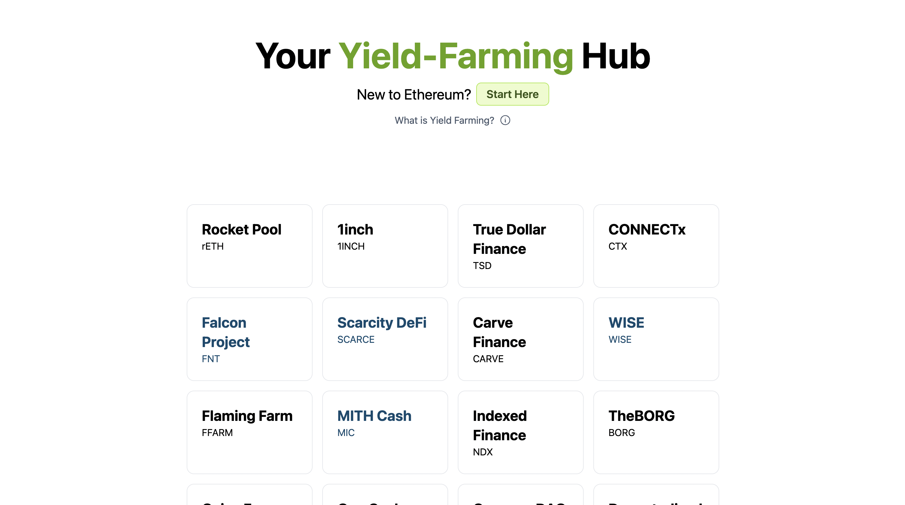

# Yield-Farming

## A Simple Yield Protocol Aggregator Website

This app uses [Tailwind CSS](https://tailwindcss.com/) [(v3.2)](https://tailwindcss.com/blog/tailwindcss-v3-2) and Next.js.

### Deploy a clone of this repo onto the Interplanetary File System (IPFS) with Fleek



## How to Clone and Run

1. Clone the repo

```bash
git clone https://github.com/Pryority/eth-yield-farming.git
```

2. Navigate to the newly cloned directory and install the required dependencies

```bash
yarn install
```

3. Start the frontend

```bash
yarn dev
```

[Deploy with Fleek⚡️](https://fleek.co/hosting/)
